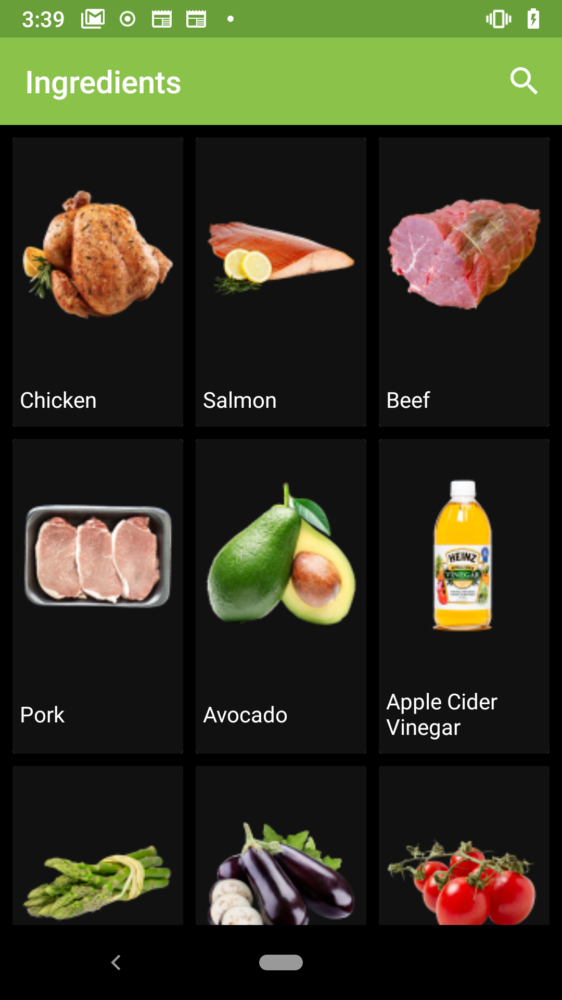
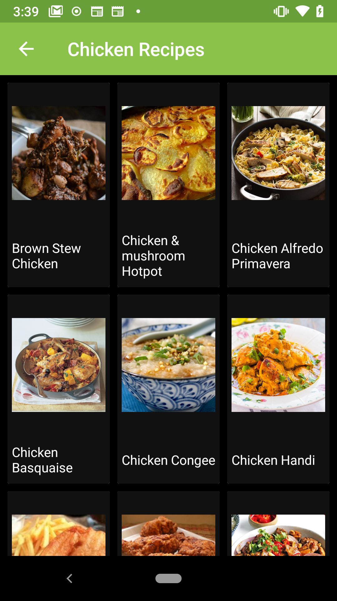
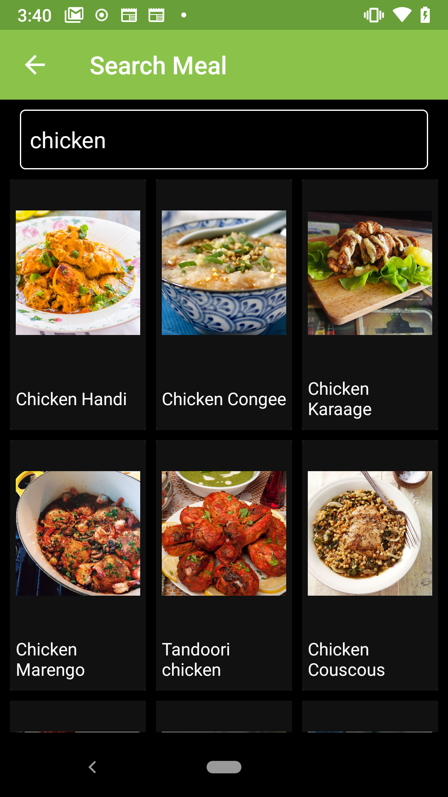
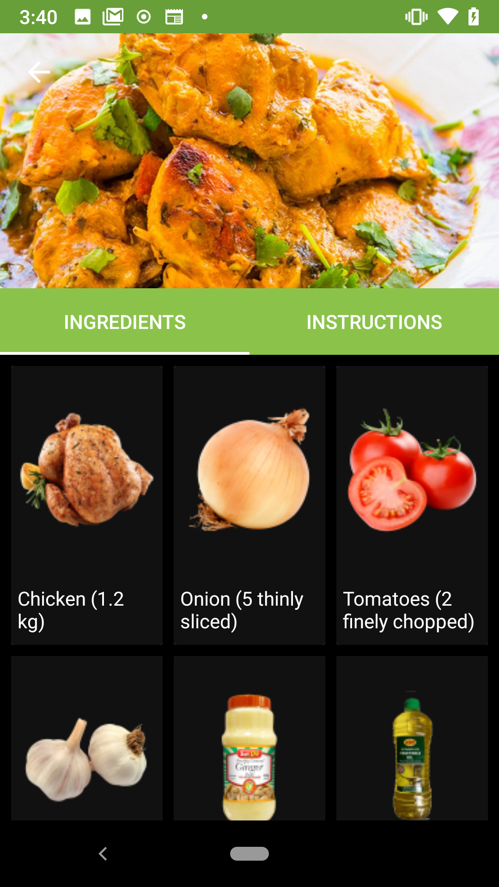
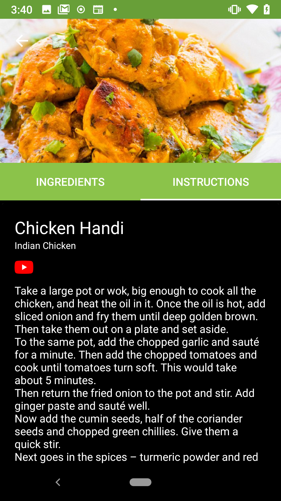

# QuickMeal
           An application which displays meals filtered by ingredients. It also allows to search meals and displays recipe for the selected meal.
## Features
  + Ingredients List
  + Meals list filtered by ingredient
  + Search meals
  + Selected meal recipe

##### Getting Started
### Highlights
  + Kotlin
  + MVVM Architecture 
  + Repository Pattern
  + LiveData
  + Retrofit2 for REST API call
  + Offline support
  + Dagger2 for Dependcy Injection
  + RxJava2 for Reactive programming
  + Paging library for pagination
  + ConstraintLayout
  + Unit test cases 
### Pre-requisites
  + Android Studio v3.5.1
  + Kotlin v1.3.60
  + Android SDK v28
  + Gradle v3.5.2

## Demo App
To run the project, clone the repository and run it via Android Studio.

## Test cases
To run the test cases, run the test folder.

## Notes
To test the offline behavior first open the app with internet connectivity, wait for data to get loaded. Close the app or go back to any previous screen, turn off the internet and open the app or go to the next page, app should load the data from cache.

